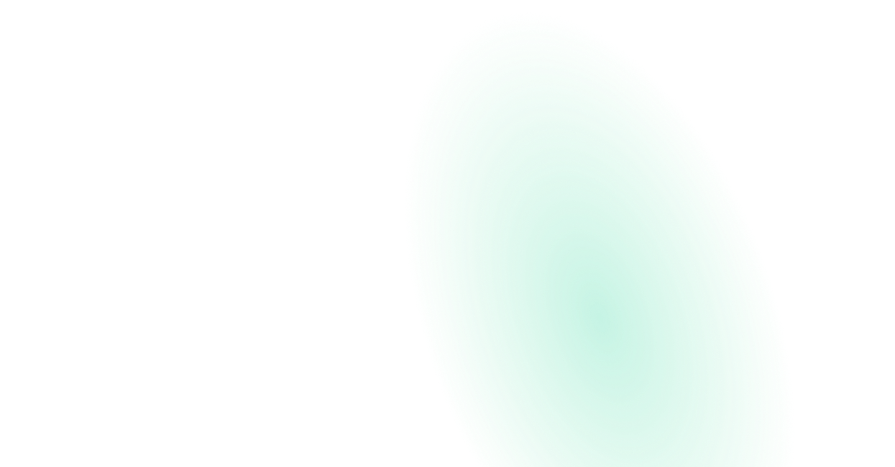

 

  <a href="https://davidvillanueva.co/" target="_blank">Website</a>
  &nbsp;&nbsp;•&nbsp;&nbsp;
  <a href="https://www.linkedin.com/in/david-villanueva-dev/" target="_blank">Linkedin</a>
  &nbsp;&nbsp;•&nbsp;&nbsp;
  <a href="https://twitter.com/Villa_dev_" target="_blank">Twitter</a>
   
  

<h2> About me </h2>
<ul>
    <li>🪶🌿 I love doing bird-watching and gardering</li>
    <li>🚩🚀 I'm currently working with javascript to build blazing applications</li>
    <li>👥🔥 I co-organized a Javascript community in Barranquilla</li>
</ul>

<!--
**Newville23/Newville23** is a ✨ _special_ ✨ repository because its `README.md` (this file) appears on your GitHub profile.

Here are some ideas to get you started:

- 🔭 I’m currently working on ...
- 🌱 I’m currently learning ...
- 👯 I’m looking to collaborate on ...
- 🤔 I’m looking for help with ...
- 💬 Ask me about ...
- 📫 How to reach me: ...
- 😄 Pronouns: ...
- ⚡ Fun fact: ...
-->
